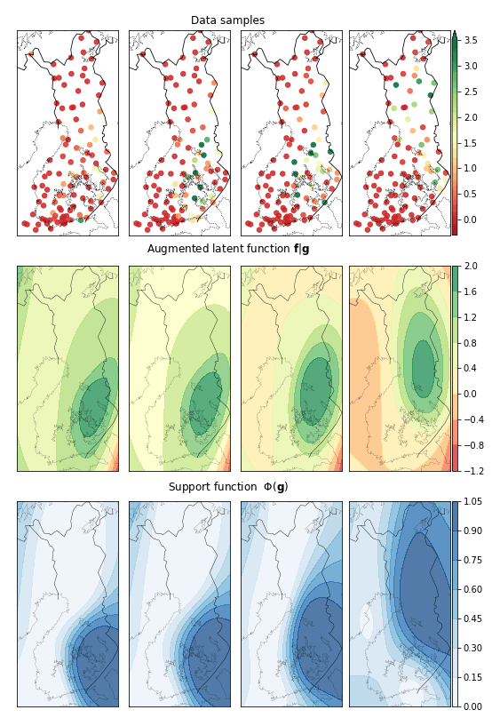

# zero-inflated-gp
Implementation of Variational Zero Inflated Gaussian Process with Sparse Kernels

**Simulated example**

This toy example was generated by taking samples from a smooth function and setting some of the values to zero.
'onoffgpf' module provides implementation of Zero-inflated GP (onoffgp) model in GPflow (0.4.0) framework (https://github.com/GPflow/)
The model fit on the precipitation dataset is illustrated below.

**Finnish precipitation dataset**

The Finnish precipitation dataset 'data/pptr.pickle' contains rainfall measurements across 105 observatories for the month of June 2018. Data has been taken from Finnish Meteorological Institute (http://en.ilmatieteenlaitos.fi/)

For this experiment, the main model along with Kronecker approximations is implemented in TensorFlow. All the supporting functions under 'onoffgp' module have been cloned/inspired from GPflow(https://github.com/GPflow/)

 Run create_cvsplits.py to generate cross-validation splits of the entire dataset

 Following models have been implemented in the corresponding scripts:
 1. Zero-Inflated GP (onoffgp.py)
 2. GP regression (svgp.py)
 3. GP classification (scgp.py)
 3. Hurdle models (hurdle.py)
 4. Zero inflated model : GPC + GPR (zeroinflated.py)

The model fit on the precipitation dataset is illustrated below.

